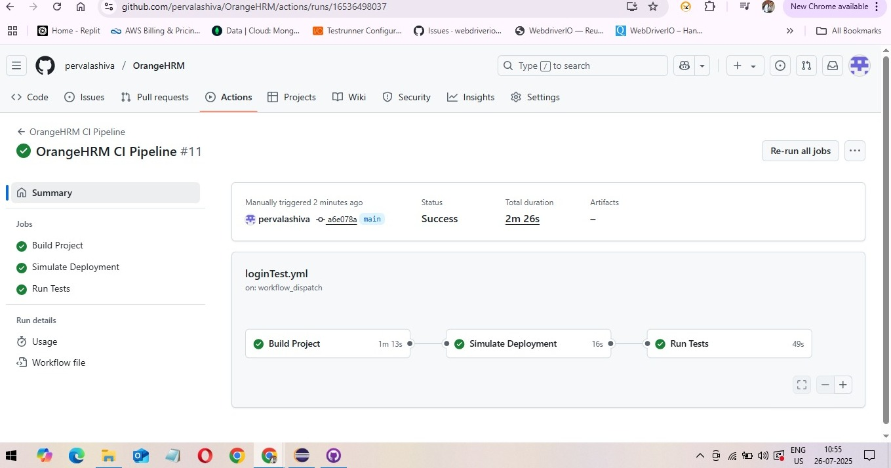
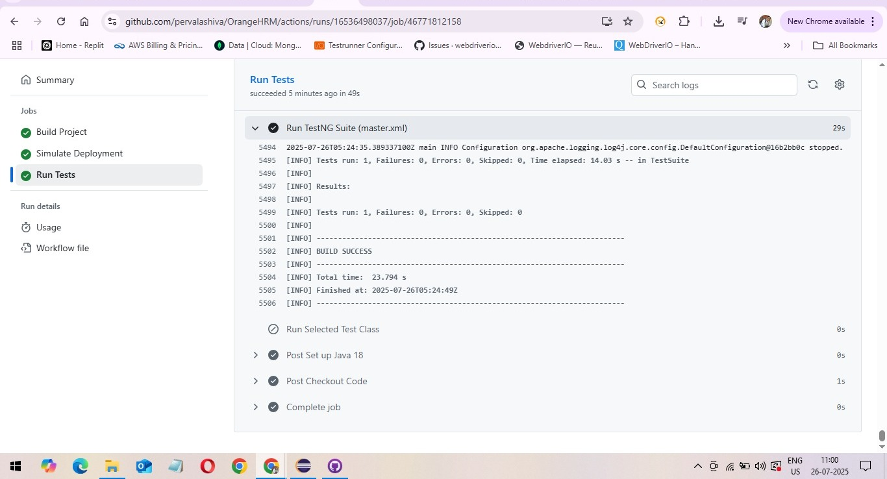

# 🧪 OrangeHRM Java Selenium Automation Project

This project is a complete automation testing framework built using **Java**, **Selenium WebDriver**, **TestNG**, and **Maven** to test key functionalities of the **OrangeHRM web application**. It also features **CI/CD integration with GitHub Actions**, enabling test execution on every push or manual trigger.

---

## Key Features

- **Automated Test Cases** for:
  - 🔐 Login functionality
  - 📊 Data-driven login (DDT using Excel)
  - 👨 Add Employee
  - 👥 Add User
- **Cross-browser setup** (configurable)
- **TestNG XML suite** support for structured test execution
- **GitHub Actions Integration**: Automatically runs tests on commits and manual triggers
- **Maven** used for build and dependency management
- **Extent Reports** and logs (optional add-on)

---

## 📂 Project Structure
├── src
│ ├── main
│ └── test
│ ├── java
│ │ └── testCases
│ │ ├── TC001_Login.java
│ │ ├── TC002_LoginWithDDT.java
│ │ ├── TC003_AddEmployee.java
│ │ └── TC004_AddUser.java
│ └── resources
│ └── master.xml
├── pom.xml
└── .github
└── workflows
└── test-automation.yml
---

## 🚀 How It Works with GitHub Actions

- Workflow is triggered via `workflow_dispatch` (manual trigger with input) or can be adapted to run on `push` or `pull_request`.
- Automatically:
  1. Sets up Java & Chrome
  2. Builds the Maven project
  3. Runs specified test(s) from the `testng.xml` suite or main class
- Parallel test execution can be enabled via TestNG configuration.

---

## 🧪 Running Tests Locally

To run tests from your local machine:

```bash
# Run full suite
mvn clean test -DsuiteXmlFile=src/test/resources/master.xml

⚙️ CI/CD with GitHub Actions
This project includes a GitHub Actions workflow file that:

Supports both TestNG suite and main class-based test execution

Allows manual selection of test class via UI

Runs on Windows runners with Java and Chrome pre-configured

📌 Tech Stack
Java 11 / Java 18

Selenium WebDriver

TestNG

Maven

Apache POI (for Excel DDT)

GitHub Actions (CI/CD)

ExtentReports (optional for reporting)
## 📸Test Exicution using git Actions Screenshots

### 🔄 GitHub Actions Test Triggered


### 🧪 TestNG Test Executed via Build



